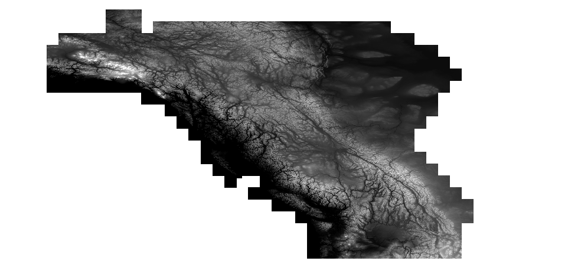

Data Acquisition and Preprocessing
==================================

Set up Cloud Computing
----------------------

(Or local machine if it’s beefy enough, &gt;=128GB ram required!).
**Assumes installation on Ubuntu Linux because it’s commonly offered in
cloud compute services.** These instructions are intended to minimize
setup time and costs associated with hourly compute resources (~$1-3 per
hour on [DigitalOcean](https://www.digitalocean.com/pricing/calculator/)
for 128 GB RAM, 12 core processor.)

**Install GDAL**

> `sudo add-apt-repository ppa:ubuntugis/ubuntugis-unstable`  
> `sudo apt update` `sudo apt upgrade`

Install software utilities:
&gt;`sudo apt-get install libgdal-dev gdal-bin libproj15 libproj-dev openmpi-bin libopenmpi-dev libboost-iostreams-dev parallel unzip dos2unix zip`

**Clone the repository (from the root directory)**

> `git clone https://github.com/dankovacek/hysets_validation`

Change directories to the `hysets_validation` folder:
&gt;`cd hysets_validation`

### Install Python package manager (pip)

If not automatically installed, install Python and virtualenv (assuming
Python3 is installed by default on a linux distribution):

> `sudo apt install python3.8-venv pip`

Create Python 3.8+ virtual environment at the root level directory:

> `python3 -m venv env/`

Activate the virual environment:  
&gt;`source env/bin/activate`

Install Python packages:  
&gt;`pip install -r requirements.txt`

Download Source Data
--------------------

To replicate the HYSETS study with the same DEM source, follow the
instructions for EarthEnv DEM90 below. To use a higher resolution DEM
from 3DEP, skip to the next section. Note that the higher resolution
data is far more memory intensive, &gt; 32GB ram is required to process
the DEM.

### EarthEnv DEM90

HYSETS used EarthEnv DEM90 (~90m resolutoin) data to derive basins and
physical / topographical attributes. The tiles are available at
[earthenv.org/DEM](https://earthenv.org/DEM). We can download the tiles
and merge them into a virtual raster with gdal using the following
script in `setup_scripts`:

> `python get_EarthEnv_DEM.py`

Links to invidivual DEM tiles look like the following:
&gt;`http://mirrors.iplantcollaborative.org/earthenv_dem_data/EarthEnv-DEM90/EarthEnv-DEM90_N55W125.tar.gz`

The resulting .vrt mosaic should look like below:

### USGS 3DEP DEM

Alternatively, you can use newer, higher resolution (1 arcsecond or
~20-30m) DEM from the 3D Elevation Program(3DEP) and assemble it into a
virtual raster file using GDAL. It is noted in HYSETS that basins
smaller than 50 km^2 were not delineated due to the input DEM being too
coarse. Higher resolution data can capture many basins smaller than 50
km^2, though a lower limit has not been identified.

The 1-arcsecond set contains several small gaps near the Yukon-Alaska
border, so the gaps are filled with 2 arcsecond data from the same
source. GDAL automatically selects the highest resolution data
available. Custom file lists can be generated by visiting the [TNM
download application](https://apps.nationalmap.gov/downloader/#/) where
you can draw a polygon on the map over your region of interest and
generate a list of DEM files corresponding to the layers selected:

Download the tiles and merge them into a virtual raster
(`USGS_3DEP_mosaic_4326.vrt`) with gdal using the following script in
`setup_scripts`:

> `python get_3DEP_DEM.py`

Note that if the vrt srs (-a\_srs flag) in the `gdalwarp` command is not
set, the default will be EPSG 4269 which doesn’t appear to be correct.
Setting 4326 appears to produce properly aligned geometry. The resulting
.vrt should look as follows:

### National Hydrographic Network (NHN)

The complete basin regions are provided in the repository under
`hysets_validation/processed_data/merged_basin_groups/final_polygons`.
Given these pre-processed group polygons, create a clipped DEM and
reproject to EPSG:3005. From `setup_scripts/`:  
&gt;`python dem_basin_mapper.py`

The remainder of this section is optional, and is provided for reference
to document the process of breaking up the study region into complete
areas (i.e. polygons that have only outflow, no inflow).

The [national blue-line
network](https://open.canada.ca/data/en/dataset/a4b190fe-e090-4e6d-881e-b87956c07977)
is a vector-based representation of surface water in Canada. The index
contains 1341 polygons representing “Work Unit Limits” (WLU) based on
sub-sub drainage areas. Here we will filter the polygons to find all
those intersecting with the polygon describing the BC provincial border,
and then group the work units into larger regions representing the major
drainage basins covering the province. The purpose of merging into
larger groups is to avoid having polygons break up continuous rivers, as
the subsequent step is to calculate flow accumulation networks for all
basins covering the province. Hydrographic features covering the study
area will be downloaded in the script that follows.

Map the group basins into the minimum covering set. Use the script found
in `setup_scripts/`. (ensure the virtual environment created above is
activated from the step above, you should see `(env) root@...` in your
terminal). From `setup_scripts`:

> `python process_complete_basin_groups.py`

The script will download the NHN file containing geometries
corresponding to hydrographic features in BC. The script then takes the
sub-sub-drainage polygons and converts them to hydraulically separate
regions, in other words polygons do not cut flow paths anywhere in the
province. See the images below for original and processed data polygons:

 

The DEM processing will transform the raw DEM mosaic (below-left) to the
processed, trimmed and transformed to BC Albers 3005 projection, and
grouped into 18 major basins and drainage regions described above
(below-right).

Additional information on trimming ocean out of coastline for southeast
Alaska, BC, and Washington state is included in the [Trim Coastline Dem
section below](#markdown-header-trim-coastline-dem). Additional details
about the NHN are also provided in the [Additional Notes section
below](#markdown-header-nhn-additional-notes).

**GLHYMPHS**

For porosity and permeability, HYSETS used the dataset from GLobal
HYdrogeology MaPS \[@gleeson2014glimpse\].

> `mkdir source_data/GLHYMPHS_data/`

You can’t use wget here unfortunately. Not straightforward to
auto-download because of license modal. Visit the link below, download,
and transfer to the data drive (~1.1 GB):

> `https://dataverse.scholarsportal.info/dataset.xhtml?persistentId=doi:10.5683/SP2/DLGXYO`

The file is called something like `GLHYMPS.zip` and you can transfer it
from your **local machine** to your cloud instance using `scp`:  
&gt;`scp /local/path/GLHYMPS.zip root@<cloud-ip-address>:/hysets_validation/source_data/`

Then unzip the file on the remote machine:  
&gt;`unzip GLHYMPS.zip`

**NALCMS**

Land use percentages (forest, grassland, crops, etc.) is derived from
the North American Land Change Monitoring System:

> `cd source_data/`  
> `mkdir NALCMS_data/`  
> `cd NALCMS_data/`  
> `wget http://www.cec.org/wp-content/uploads/wpallimport/files/Atlas/Files/2010nalcms30m/north_america_2010.zip > north_america_2010.zip`  
> `unzip north_america_2020.zip -d .`

### HYSETS

The complete set of files associated with the HYSETS paper is ~14.6 GB
and can be accessed [here](https://osf.io/rpc3w/). However, for
validation we only need the results file, basin geometry, and station
locations. The results file is included in the repo, and we can download
the rest with the following script, found in `setup_scripts/`:

> `cd setup_scripts` `python get_HYSETS_data.py`

The basin polygon file (~15GB) could take 15-20 minutes on it’s own to
download, so open a second terminal window and continue the setup
process while this file is downloading.

The process of delineating basins requires the specification of a pour
point for each station. The accuracy of basin delineation is highly
sensitive to the specification of pour points. Pour points are not
specified for the polygons derived for this study, so these must be
derived from WSC and USGS data. Pour points for WSC stations were
recently published and these are downloaded in the next step. You may
find that station locations do not yield accurate catchment delineations
when using station locations.

Next we will download basin polygons from the WSC. These files contain
both station locations and pour points which produce much better results
when validating the catchment polygon.

### WSC Hydrometric Station Catchment Polygons and Metadata

An updated set of basin polygons from WSC, published in December 2021,
can be downloaded and processed by the following script located in
`setup_scripts`. You can customize the region of interest by modifying
the list of basin prefixes, i.e. BC is covered by 07, 08, 09, and 10.

> `python get_WSC_data.py`

The `source_data` folder contains the WSC station metadata file of
active and historic hydrometric stations `WSC_Stations_2020.csv`.

Next we choose one or both DEM sources to download tiles and construct a
DEM mosaic file covering the study area.

Basin Delineation and Attribute Validation
------------------------------------------

This step represents the heavy lifting where large regions of DEM such
as the Liard, Peace, and and Fraser River basins are processed into flow
direction and flow accumulation at the highest available resolution.
Three tools were evaluated for the step of validating HYSETS basins:
[Whiteboxtools](python%20process_dem_by_basin.py),
[RichDEM](https://richdem.readthedocs.io/en/latest/), and
[Pysheds](https://mattbartos.com/pysheds/). Each have distinct feature
sets, but Pysheds was used here for the step of delineating a large set
of basins.

<!-- Note: the breach [depression function](https://jblindsay.github.io/ghrg/Whitebox/Help/BreachDepressions.html) run on the DEM is a bottleneck step.   -->

The final step is to validate the basin attributes derived in HYSETS (or
other dataset) using the set of stations whose catchment boundaries
intersect BC. The manual basin delineation step is the most
computationally intensive step of the validation process, and it’s
executed with the script `setup_scripts/delineate_basins.py`

> `setup_scripts/python pysheds_derive_basin_polygons.py`

Additional Notes
----------------

### Broken Pipeline

If you are having “broken pipe” errors using a remote server add
`ServerAliveInterval 360` to `ssh_config`:

> `sudo nano /etc/ssh/ssh_config`

### Trim Coastline DEM

Note that the raw dem includes considerable areas of ocean that would
cause issues if included in any hydrologic processing. The
dem\_basin\_mapper.py script includes a shortcut where polygons were
pre-processed using a combination of coastline polygon sources to trim
ocean out of the DEM and create separate DEM files for each regional
group. In the image above, Haida Gwaii has been trimmed along the
coastline, while the coastline to the east shows the area that is
identified for trimming.

In the `setup_scripts` folder, there is a Jupyter Notebook file
`Trim_Coastal_Group_Polygons.ipynb` where the trimming process is shown.
The coastline geometries are derived from several sources, described
below.

Shape files describing the BC coastline, PNW (Washington state), and
southeast alaska basins are used to refine DEM masks from the watershed
region groups, and to include the area of southeast alaska not covered
in the NHN regional groupings.

**Southeast Alaska Basins**: get the geojson file and save it as
`USFS_Southeast_Alaska_Drainage_Basin__SEAKDB__Watersheds.geojson`:
&gt;https://hub.arcgis.com/datasets/seakgis::usfs-southeast-alaska-drainage-basin-seakdb-watersheds/about

**FWA Coastline Geometry**: get the geojson file for the BC coastline
and islands. Here you have to submit a request. The file is assembled
and distributed to your email automatically:

> https://catalogue.data.gov.bc.ca/dataset/freshwater-atlas-coastlines

**PNW Shoreline Shapefile** The southern extent of the coast is also
interrupted by the national border. Use the PNW coastline shape file to
crop the fraser basin ([*Shoreline for the Pacific Northwest
Region*](https://pubs.usgs.gov/ds/2006/236/download/shoreline_pacnw.zip)):

> https://pubs.usgs.gov/ds/2006/236/catalog.shtml\#GIS\_data\_table

NHN Additional Notes
--------------------

The NHN data contains many hydrologic features in detail, provided in
shape files by WLU, as described in the documentation linked above:

> *“It provides geospatial digital data compliant with the NHN Standard
> such as lakes, reservoirs, watercourses (rivers and streams), canals,
> islands, drainage linear network, toponyms or geographical names,
> constructions and obstacles related to surface waters, etc.”*

Data such as obstacles will be important for catchment delineation, as
obstacles such as bridges can interfere with the flow direction and
accumulation steps.

To access individual WLU attribute objects, use the following
convention:

> `https://ftp.maps.canada.ca/pub/nrcan_rncan/vector/geobase_nhn_rhn/shp_en/XX/<filename>`

Where `XX` is the two-digit major drainage area (MDA) prefix (BC is
covered by codes 07, 08, 09, and 10). `<filename>` is for example
`nhn_rhn_07aa000_shp_en.zip`.

The feature files related to the WLU groups in the set covering BC were
downloaded and saved to the `processed_data/` folder when the
`process_hydrologic_regions.py` script was executed above.

An example of the features contained in these files is shown below
(shown imported in [QGIS](https://qgis.org/en/site/)):

### Merge Stream Vectors for Burning

Use the WSC SDA IDs to group NHN features into the same polygons as
defined for the regional groupings. In each NHN vector file
(i.e. `nhn_rhn_07aa000_shp_en.zip`, see National Hydrographic Network
section above) there is a layer containing the string `NLFLOW` which
represents the continuous stream network. Similar to how the
sub-subbasins were grouped above, use the same procedure to group the
stream vectors and save them as separate files. These will be used in
the FillBurn processing step for dem conditioning.

> `python group_stream_vectors.py`

GeoBC Digital Road Atlas
------------------------

Especially using higher resolution DEM, roads and bridges create issues
when delineating basins. Use the provincial road atlas in combination
with national hydrographic network streams to breach dems that don’t
delineate properly due to man-made obstructions.

Download the [Digital Road Atlas from the Gov’t of
BC](https://www2.gov.bc.ca/gov/content/data/geographic-data-services/topographic-data/roads),
or access the `.geojson` file using an ftp client (I used the
open-source software [Filezilla](https://filezilla-project.org/))
directly from the [ftp
link](ftp://ftp.geobc.gov.bc.ca/sections/outgoing/bmgs/DRA_Public/).

This was tested with the Whiteboxtools
[BurnStreamsAtRoads](https://www.whiteboxgeo.com/manual/wbt_book/available_tools/hydrological_analysis.html#BurnStreamsAtRoads)
tool, without noticeable improvement in the results (could be an issue
with my implementation).

### Global River Classification (OPTIONAL)

https://ln.sync.com/dl/3d4952ac0/isuvquck-82fv4ca6-2vxh8nwm-fpeg9mra

Notes
-----

### Once processing is complete, you will need to transfer the results back to your local machine

Create folders and copy files using `scp` command:

> `scp setup_scripts/ account@1XX.XX.XXX.XX`. Here, `account@1XX.XX...`
> is the account name and IP address of the machine. You can specify a
> different path by adding a colon after the IP address (:),
> i.e. `account@XX.XX.XX:home/custom_path/data/`. The path must first be
> created on the destination machine.

To automate citation formatting for the README document.

> `pandoc -t markdown_strict -citeproc README-draft.md -o README.md --bibliography bib/bibliography.bib`
